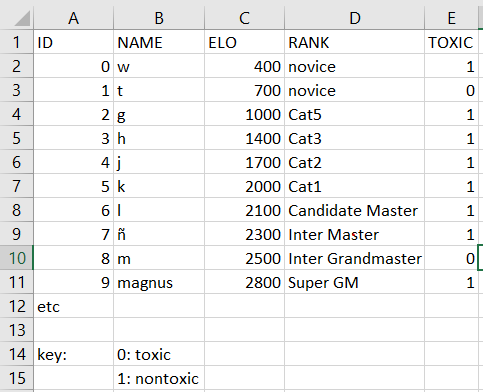
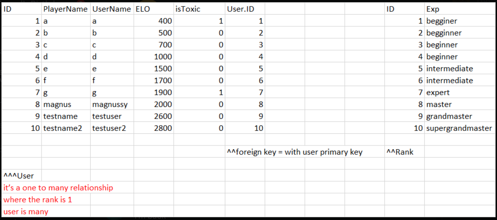
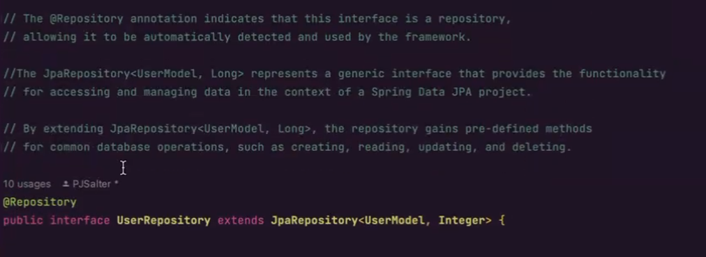
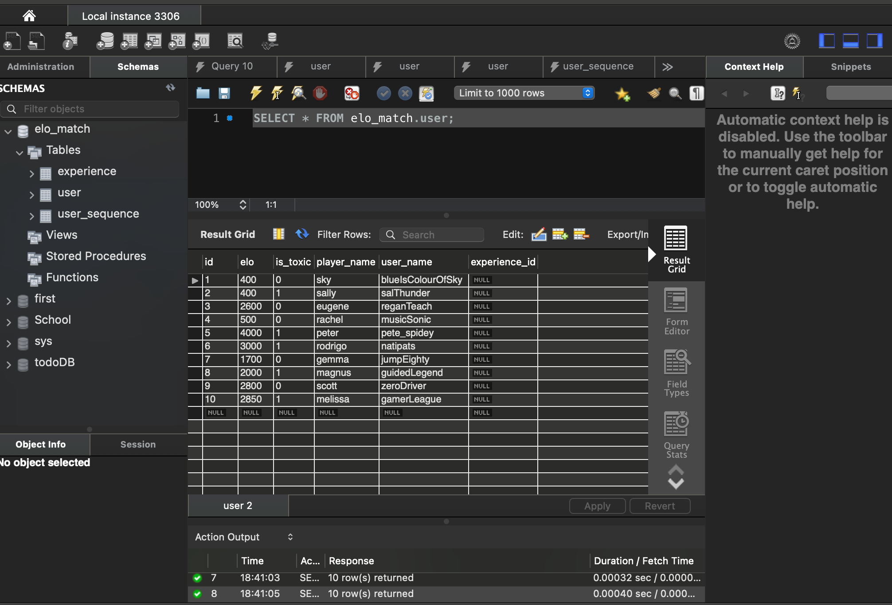
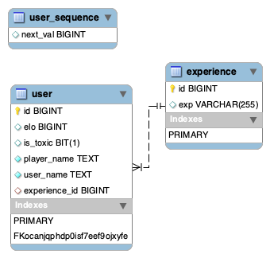

ELOmatch
---

- [Click here for GitHub 💀💀💀](https://github.com/natipats/ELOmatch)
  
### Organisation:

- 30 second stand up - beginning Friday 26th
- Talking about what we plan to tackle at the start in the morning.
- Remembering to write comments along the way for the implementation of syntax.
- create a Kanban board on GitHub with 'To Do', 'In Progress' and 'completed tasks' rows.
- separate each task in different tickets, treating them as tickets.
- come up with a possible name for the app.
- Instructions in README.md on how to set up on local machine.

---

### Collaboration:

- Division of labour: Big tasks might need to be worked on in tandem, however smaller tasks might be achieved individually and uploaded to the main branch of the project
- Personal branches and main branches will have more contributions
- Regular reviews and weekly scrums will ensure no conflict occurs
- Share screen and working from discord.

### Deliverables:
A complete submission will include:

- All required code files
- Database Scripts
- Planning and documentation files, including flowcharts, UML's and ERD's
---
#### Submission:

In most cases, we will submit a URL to the GitHub repository used for this project. Eugene may provide alternative instructions on how to submit the files.

---

#### Presentation:

- Presentation should be 10-15 minutes long
    - we will be doing around 3-5 minutes, we will split the presentation in half and present the half we like the most

- Presentation should include:
    - Intro/high level description to the project, it should describe the function accurately
    - describe how the app works with help of UML's, flowcharts, ERD's, etc...
    - Information about the technology stacks used in the project
    - Demonstrate how the application works, especially the CRUD functionality, login utility, and any other features we want to highlight.
    - Lessons learned, eg. Describe problems we encountered and how you overcame them. What would we do differently next time?

### Requirements:
Code must use MVC, object orientation

Code must have appropriate unit testing
- test all CRUD operations

Error handling where appropriate and must display proper error messages

App has to use spring tools to build the code

We MUST include a database:
If you are using a relational database, such as MySQL:
- Use an ERD to describe the database.
- The database must use appropriate tables and fields.
- The database must be normalized to at least 2NF; 3NF preferred.
- Create and submit a schema .sql file to create the database and a data .sql file to add data to the database.


If you are using a non-relational database, such as MongoDB:
- Provide documentation that describes the type of data included in the database.
- Include a JSON file with examples of the data included in the database.

We can discuss with eugene which database is preferred for our specifications

The application must use JDBCTemplate or JPA to perform CRUD operations on data using appropriate REST API endpoints.

- At a minimum, the application must include endpoints to Create, Read all, Read by Id, Update by Id, and Delete by Id.
- Include server data validation before writing data to the database.
- Other endpoints may be needed based on the goal of the application.

The application must include a frontend GUI interface to interact with the end user.

- The frontend may be written in JavaScript, jQuery, React, or Angular.
- Implement data and form validation.

The application must use a version control system for code.

- At a minimum, Git must be used to manage files locally.
- Ideally, the project will be synchronized to a GitHub repository, potentially using GitHub Classroom at the instructor's direction.

### Stretch Goals

The following arent required for the assignment to receive a passing grade and would probably be better finished after the assignment itself is 100% done and we find that we have enough time to implement the following extra features:


- Login control, including a secure login
- A dashboard feature
- Any additional features included in the initial planning steps that are not included in the requirements

A good way to quickly implement these would be with the help of Bootstrap templates that come with these features preprogrammed in, then we simply have to modify the Bootstrap to fit our needs.

### Code Requirements

- The controller of the program needs to be able to instert into database, needs to delete entries by id, update them by id, read all, and read by id.
- the view should let the user see player information
    - Player information should contain:
        - Player Name, Player ELO/rank
    - Player information that should stay hidden:
        - Sensitive information, toxicity status

- Exception handling. I would recommend having a separate folder for exceptions
- Dao
- Model/Entity
- service layer 
- Mappers
- GUI
- database looks something like this: 

---

## Issues:

- Issues will be written as they are discovered, all issues are now in github

## Diary

25/05/2023 - finished setting up git, created main and local branch, installed and fixed spring in rodrigo computer, installed mysql and workbench in rodrigo computer, organised and fixed dependencies, and database on excel.
- TODO tomorrow: create database, start coding entity/model, use spring annotation

26/05/2023 - issues made in kanban board, research made in JPA vs JDBC
- TODO: decide if JDBC or JPA becomes the choice going forward, implement database.





28/05/2023 - added pseudocode inbetween lines, broke down every annotations, noargsconstructor allows us to create instances of the class without providing initial values.
all args contrustor allows us to create constructors in the background so we dont have to do it. The @entity is the table itself that is mapped. line is @Table(name="tablename").
@Id represents the entity, initialises the ID and creates it for us. 
@sequenceGenerator does what it says on the tin.
@GeneratedValue gives value to the sequence.
@Column makes the columns
@ManyToOne defines the table as many to one. where users was many and rank is one.
@JoinColumn joins the columns.
class UserRepository uses @Repository to indicate the interface and the framework for the database, also allows to create operations and we write the methods.


In RankModel class we have the @OneToMany annotation, allows us to connect with the User model table and adds the UserID.
Below is the list of the user model but it pick ups the userID of the userModel list. 

RankController class  has @Restcontroller which indicates that its a special controler (special controller is a REST for API, it controlls the database and picks up whats needed) .
@RequiredArgsController annotation gens the constructor for dependencies.

- TODO: sequence generator is causing a bug creating a third table, perhaps use third table made by mistake as a login table, TBD if time allows. 
- Theres another bug causing the constructors in ELOmatch that make a new UserModel, however the data isnt appearing on the table
- UserIO might no longer be necessary TBD

29/05/2022 - fixed every bug listed above, finished implementing basic JPA, and annotations are fully finished, redundant or unnecessary classes and code have been removed
- TODO: mapper is missing, needs to be implemented differently from a normal JDBC impl. 
- front end and validation are likely the next steps
- presentation and UML diagrams are dawning on us 
- bootstrap needs implemented.

http://localhost:8080/

30/05/2022 - added mapper, implemented bootstrapper and added thymeleaf connection, tested website on localhost and works fine.
Presentation is 90% finished needs more details before its finished, UML is simple but also done
- TODO: basic database insertion and entry deletion implementation, implement matchmaking functionality as well
- display the results of the matchmaker into the website as a GUI

31/05/2022 - Added HTML table, it functions but needs to get populated.
Emergent issue, error with the service method has stopped progress (it wasnt picking up users), Eugene is doing us a favour and checking out the problem and will get in touch with us tomorrow with a fix
-Added extra detail to documentation, did a standup with eugene and showed progress done so far, as well as discussed and adviced on priorities and how to move forward.
- TODO: Getting the data onto the page is top priority as instructed by the nice irish person, getting even an inkling of functionality is likely all thats required to pass at this point
- trycatch needs implemented, validation needs to be kept in mind when adding functionality, unit testing needs to be added, custom exceptions needed.
- Late in the evening Unit-testing was created and passing.

01/05/2022 - Matchmaker implemented in a separate file for testing purposes, it works fine, code can be found below.

02/05/2022-05/05/2022 - Implemented all expception handling, created add and delete methods, did our presentation and it went quite well.
had an issue with conflicting git commits, it has been fixed and all local versions are up to date and have parity. After following some advice from eugene we believe we are within passing grade range and should focus our effort on the absolute essentials, stuff like the matchmaker algortithm itself isnt even entirely necessary to get perfectly so long as we have what we have.

unit tests take priority, populate the database a little more
edit database is maybe also good
but for now forget about the rest, we have a thing, and it works


``` Java

 package org.example;

import java.util.ArrayList;
import java.util.List;

public class Matchmaker {
    public static void main(String[] args) {
        // Create a list to store user information
        List<User> userList = new ArrayList<>();

        // Add users to the list
        userList.add(new User(1000, "User1", false));
        userList.add(new User(1200, "User2", false));
        userList.add(new User(800, "User3", false));
        userList.add(new User(1500, "User4", true));
        userList.add(new User(1100, "User5", true));
        userList.add(new User(900, "User6", true));

        // Separate users based on toxicity level
        List<User> toxicUsers = new ArrayList<>();
        List<User> nonToxicUsers = new ArrayList<>();
        for (User user : userList) {
            if (user.isToxic) {
                toxicUsers.add(user);
            } else {
                nonToxicUsers.add(user);
            }
        }

        // Pair non-toxic users based on closest elo
        List<Pair> nonToxicPairs = pairUsersByClosestElo(nonToxicUsers);

        // Pair toxic users based on closest elo
        List<Pair> toxicPairs = pairUsersByClosestElo(toxicUsers);

        // Print the pairs
        System.out.println("Non-Toxic Pairs:");
        for (Pair pair : nonToxicPairs) {
            System.out.println(pair);
        }

        System.out.println("\nToxic Pairs:");
        for (Pair pair : toxicPairs) {
            System.out.println(pair);
        }
    }

    // Method to pair users based on closest elo
    public static List<Pair> pairUsersByClosestElo(List<User> users) {
        List<Pair> pairs = new ArrayList<>();

        // Sort users by elo in ascending order
        users.sort((user1, user2) -> user1.elo - user2.elo);

        int i = 0;
        int j = users.size() - 1;

        while (i < j) {
            User user1 = users.get(i);
            User user2 = users.get(j);
            pairs.add(new Pair(user1, user2));
            i++;
            j--;
        }

        return pairs;
    }

    // User class to store user information
    static class User {
        int elo;
        String userName;
        boolean isToxic;

        User(int elo, String userName, boolean isToxic) {
            this.elo = elo;
            this.userName = userName;
            this.isToxic = isToxic;
        }
    }

    // Pair class to represent a pair of users
    static class Pair {
        User user1;
        User user2;

        Pair(User user1, User user2) {
            this.user1 = user1;
            this.user2 = user2;
        }

        @Override
        public String toString() {
            return "[" + user1.userName + ", " + user2.userName + "]";
        }
    }
}

```


### removed this code after data stored in MySQL workbench 

- had to remove and delete content of data created after running because it would duplicate the same 10 users everytime we ran the project causing us to have thousands of uses

code we had to remove:

```java


public class EloMatchApplication implements ApplicationRunner {
    
private final UserService userService;

/**
	 * @param args
	 * @throws Exception
	 */
	@Override
	public void run(ApplicationArguments args) throws Exception {
     // Automatically doing what we write here.
		User sky = new User(
				"sky",
				"blueIsColourOfSky",
				400L,
				false
		);

		User sally = new User(
				"sally",
				"salThunder",
				400L,
				true
		);

		User eugene = new User(
				"eugene",
				"reganTeach",
				2600L,
				false
		);

		User rachel = new User(
				"rachel",
				"musicSonic",
				500L,
				false
		);

		User peter = new User(
				"peter",
				"pete_spidey",
				4000L,
				true
		);

		User rodrigo = new User(
				"rodrigo",
				"natipats",
				3000L,
				true
		);

		User gemma = new User(
				"gemma",
				"jumpEighty",
				1700L,
				false
		);

		User magnus = new User(
				"magnus",
				"guidedLegend",
				2000L,
				true
		);

		User scott = new User(
				"scott",
				"zeroDriver",
				2800L,
				false
		);

		User melissa = new User(
				"melissa",
				"gamerLeague",
				2850L,
				true
		);


		userService.saveUser(sky);
		userService.saveUser(sally);
		userService.saveUser(eugene);
		userService.saveUser(rachel);
		userService.saveUser(peter);
		userService.saveUser(rodrigo);
		userService.saveUser(gemma);
		userService.saveUser(magnus);
		userService.saveUser(scott);
		userService.saveUser(melissa);

	}
}
```

This is how our MySQL table looks with the data set.



## Database:




# Big Shout out to Eugene and Csaba for all your help through our Journey. 🥳🥳🥳