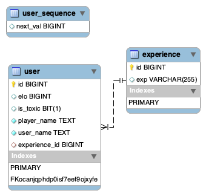

# ♜ ELOmatch ♟️

## Designed and Developed by:
- [Rodrigo](https://github.com/natipats)
- [Peter](https://github.com/PJSalter)
- powerpoint with details found in the elo-match file

# Instructions:
To start the program simply click the green arrow, wait a few seconds, and in your preferred 
browser of choice search up http://localhost:8080/. Once you're 
online you will see the contents of the database displayed in front of you with the
option of adding, deleting, and editing entries, as well as a button labelled 
"fight" which will initiate the matchmaking and will pair users according to skill level.

## Project Description
Elo Match is a simple project in JPA that aims to use
spring tools, bootstrap, and black magic, to insert and read 
from a database and display it on a website, as well as 
make a cute matchmaking system based around the rules 
and functions of chess and chess websites.

# User Stories
- user can add players to the database by inputting a name and a username
- users can edit and delete contents of the database
- users can view the database and view player elo and toxicity status of players
- users can matchmake 2 random players from the database together

# Future plans

- In the future, users will match nontoxic players only with other nontoxic players
- In the future they'll be matched accoring to their elo and experience and not randomly
- Implementing an EXP table with rankings and adding data to it to associate every player
with a rank

## ♝ Code Requirements
* [x] Set up packages for methods.
* [x] The controller of the program needs to be able to insert into database,
* [x] Method to delete entries by id
* [x] Method to update them by id
* [x] Method to read all
* [x] Code must use MVC, object orientation
* [x] Code must have appropriate unit testing - test all CRUD operations.
* [x] Wireframe
* [x] Add a try-catch
* [x] Custom error messages, error handlers in appropriate packages
* [x] We use spring tools and @annotations
* [x] Make entity relation diagram
* [x] schema.sql is submitted
* [x] Boostrap as GUI
* [x] version control set-up and functional

# 🧩Diary

- Step by step planning, work structure and organisation 🧪 [here on hackmd](https://hackmd.io/z-Ssv-XUR9G8ZmHGM9cYiw?both) 👨🏼‍💻

# ✨Database:

